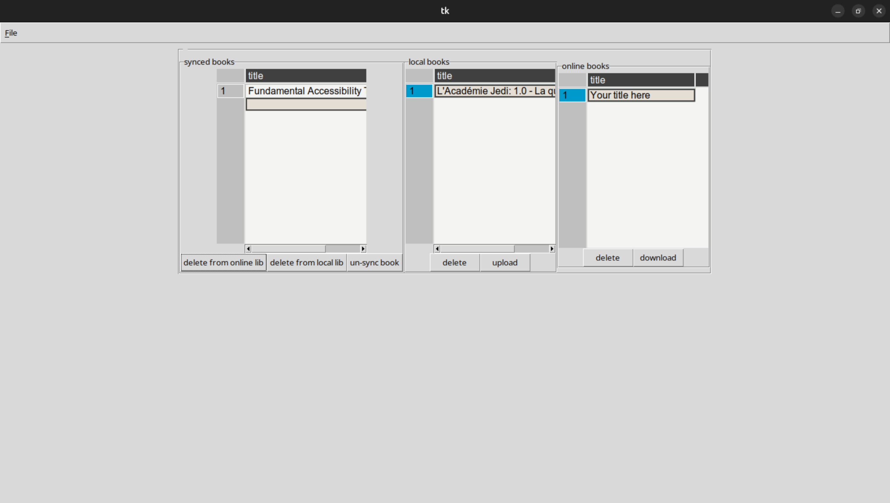

calibrolino
===================

A GUI to synchronize you calibre library with the tolino cloud. Based on pytolino to interact with tolino api.

inspired from https://github.com/darkphoenix/tolino-calibre-sync

Features
========

* upload or download books (+metadata) between cloud and local calibre library
* synchronize the tags and reading status of the books
* safe: no automatic download/upload. Only the books that are both present online and in calibre will be synchronized.
* options: auto-detect books that could be synchronize, although they have not been uploaded/downloaded with this app.

quick start
=============

calibrolino is available on pypi, so it can be run directly via `uvx <https://docs.astral.sh/uv/getting-started/installation/>`__:

.. code-block:: bash

   uvx calibrolino

Installation
============

alternativaely, one can first install it:

either with uv (recommended)

.. code-block:: bash

   uv tool install calibrolino

or with pip:

.. code-block:: bash

   pip install calibrolino

once installed, you can run it with the command:

.. code-block:: bash

   calibrolino

License
=======

The project is licensed under GNU GENERAL PUBLIC LICENSE v3.0
